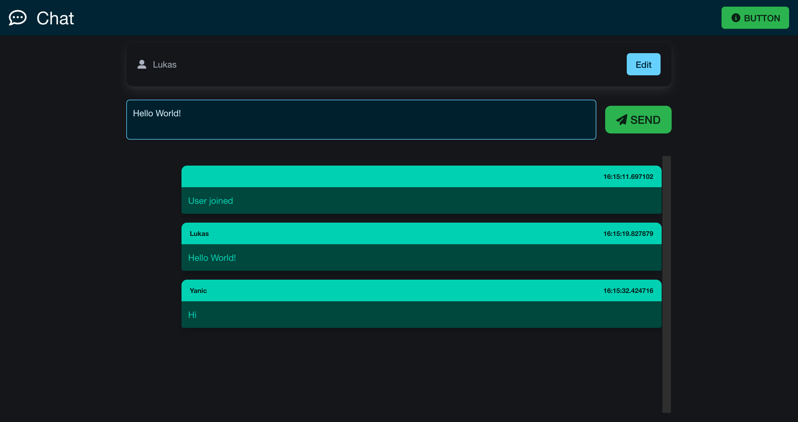

# m321-chat

A real-time Chat application to learn Microservices



## Getting Started

### Prerequisites

- Java 21 (GraalVM)
- Gradle
- Docker

### Installation

Build a microservice:

```bash
gradle build
```

Run a microservice:

```bash
gradle quarkusDev
```

## License

This program is licensed under the MIT-License. See the "LICENSE" file for more information